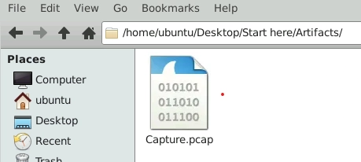
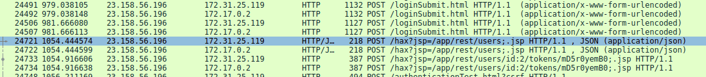
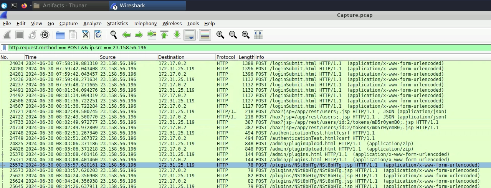

# JetBrains

> This CyberDefenders lab focuses on analyzing network traffic with Wireshark to identify web server exploitation, extract attacker IOCs and persistence mechanisms, and map attack techniques to MITRE ATT&CK.
> 

---

## Overview

*“During a recent security incident, an attacker **successfully exploited a vulnerability** in our web server, allowing them to upload webshells and gain full control over the system. The attacker utilized the compromised web server as a launch point for further malicious activities, including data manipulation.*

*As part of the investigation, You are provided with a **packet capture (PCAP)** of the network traffic during the attack to piece together the attack timeline and identify the methods used by the attacker. The goal is to determine the initial entry point, the attacker's tools and techniques, and the compromise's extent.”*

---

After starting the lab machine, we are met with the Cyber Defenders Ubuntu environment. Navigate to the “Start Here” folder and then open up the “Artifacts” directory. This contains the PCAP file that we are going to analyze.



## Questions

> 
> 
> 1. *Identifying the attacker's IP address helps trace the source and stop further attacks. What is the attacker's IP address?*

To kick off the first question, we can refer to the information from the overview. It states that, **“an attacker successfully exploited a vulnerability in our web server, allowing them to upload web-shells and gain full control.”** The first clue is the word upload. Since the attacker was able to upload to the webserver hints at the existence of one or more **POST** requests to the webserver.

We can start by looking through POST requests using this filter:

```jsx
http.request.method == POST
```

Scrolling through the POST requests, you will notice a set of unusual packet captures:



You’ll notice the line containing POST /hax?jsp=/app/rest/users;.jsp HTTP/1.1\r\n

This shows a plugin upload from an untrusted external IP. This external IP (23.158.56.196) is our attacker’s IP address.

> 
> 
> 1. *To identify potential vulnerability exploitation, what version of our web server service is running?*

We can start by right-clicking on the packet and following the HTTP Stream.


In the response body section of the POST request, you will find the field called **<server version>.** This contains our answer to question 2.

> 
> 
> 1. *After identifying the version of our web server service, what CVE number corresponds to the vulnerability the attacker exploited?*

For this question, all it requires is a little bit of google searching. We can search for our server name and the version info that we found which will lead you to this article:

#### [https://www.tenable.com/plugins/nessus/190349](https://www.tenable.com/plugins/nessus/190349)

This article covers two vulnerabilities found on this TeamCity version. One of them deals with path traversal while the other is an authentication bypass. The one that we are dealing with is related to **CVE-2024-27198** Authentication Bypass. 

> 
> 
> 1. *What credentials did the attacker successfully use for Basic Auth against the TeamCity server?*

Continuing with following the HTTP Stream, we can see in the same POST request the username and password used to authenticate to the TeamCity server.


The command used in the payload includes the credentials: 

```jsx
username: c91oyemw
```

 and

```jsx
password: CL5vzdwLuK
```

We can also see the email that was used as well as the attacker elevating the user role to “SYSTEM_ADMIN”.

> 
> 
> 1. *The attacker uploaded a webshell to ensure his access to the system. What is the name of the file that the attacker uploaded?*

Scrolling through the same HTTP Stream, we will eventually end up where the attacker uploaded the plugin.


In the Content-Disposition field, we will notice the name of the file that was uploaded (filename=”NSt8bHTg.zip”). This file contained commands that when uploaded and executed arbitrarily, would create a new user with admin privileges. The reason that it is important to identify the exact file is for remediation and ensuring the removal of any back doors created during the attack.

> 
> 
> 1. *When did the attacker execute their first command via the web shell?*

To see the exact moment the attacker executed their first command, we can read the timestamps within Wireshark. Navigate to the top toolbar and click View → Time Display Format → UTC Date and Time of Day. We can then read the time column for the first POST request made to the server.



> 
> 
> 1. *The attacker tampered with a text file that contained the credentials of the admin user of the webserver. What new username and password did the attacker write in the file?*

Following the HTTP Stream, we can see that the attacker interacted with a file named “Creds.txt”. If you have spent time in a Linux environment, you are likely familiar with the “echo” command. Echo allows users to add text to a file. We can see the attacker execute the command:

```jsx
bash -c 'echo "username:a1l4m,password:youarecompromised" > /tmp/Creds.txt'   
```


> 
> 
> 1. ***Q7** showed the attacker writing false credentials into **`Creds.txt`**. Which MITRE ATT&CK sub-technique (Data Manipulation family) describes that specific file-write action?*

After observing the attacker behavior/file tampering and some google searching, we will find the MITRE ATT&CK sub-technique under the **Data Manipulation** section category **T1565.001 - Data Manipulation: Stored Data**.

In summary, the sub-technique covers attackers manipulating file data to achieve their goals. This of course involves entering new credentials to a password file to gain access and achieve persistence within the target system.

> 
> 
> 1. *Immediately after gaining a shell, the attacker executed a docker command that mounted the host filesystem and chrooted into it — providing full host access. What was that exact command? (Do NOT include the **`cmd=`** prefix seen in the HTTP body.)*

We can continue following the HTTP POST requests filtering for “cmd”. In doing so, we will find the command the attacker executed to mount the host filesystem and gain root access. The command used was:

```jsx
docker run --rm -it -v /:/host ubuntu chroot /host
```

---

## Post Lab Analysis

This was an engaging and educational lab from CyberDefenders. As my first lab with them, it was a satisfying experience. I learned a lot about basic Wireshark techniques and threat intelligence. By analyzing a PCAP, we identified the attacker’s IP address, traced the attack, uncovered the commands and techniques used, and practiced documenting findings to support remediation.

A key lesson from this lab is to keep systems patched and up to date! Keeping critical business applications and servers current reduces the attack surface and helps prevent attackers from exploiting unpatched vulnerabilities.
